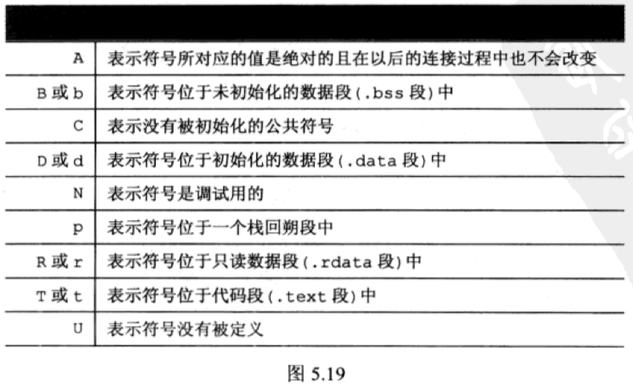

# 第 5 章 binutils 工具集，软件开发利器

* `Mon Jul  5 21:41:04 CST 2021`

**5.1 addr2line， 指令地址翻译器**

* 编译时一定要带上 `-g` 选项， 这是为了让编译器在可执行文件中放置调试信息

**5.2 ar, 静态库生成器**

* 静态库`.a`: 会被拷贝到最终的可执行程序中
* 动态库`.so`:
* `x` 解压 
* `c` 创建 / `r` 增加 /  `s` 生成索引
* `t` 查看
* `d` 删除

**5.3 nm, 符号显示器

**5.4 objdump, 信息查看器**

* `-h` 段信息 
* `-d` 汇编代码 
* `-S` 显示对应源代码 

